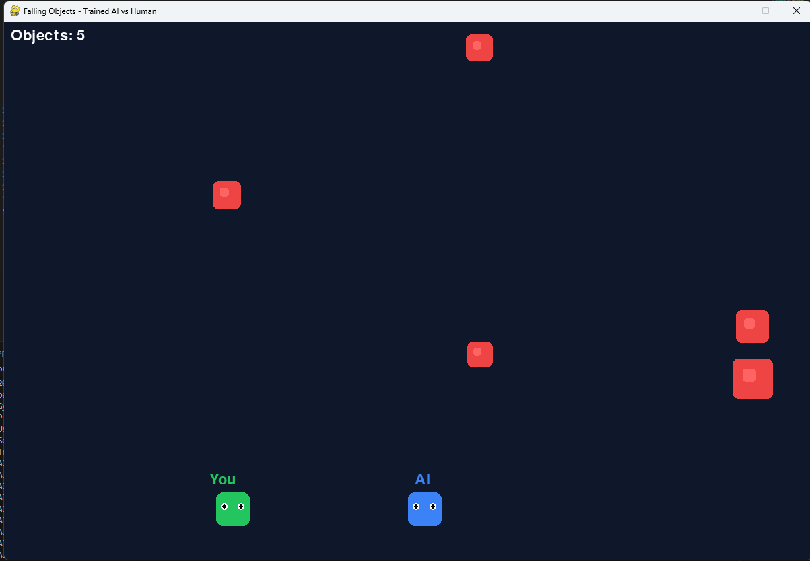

# Falling Objects - AI vs Human

A competitive pygame where you face off against an intelligent AI to avoid falling objects.



This is a screenshot of the game in action.

## Installation

```bash
pip install -r requirements.txt
```

## How to Run

### Play with Heuristic AI
```bash
python main.py
```

### Play with Trained Deep AI
First, train the model:
```bash
python train_ai.py
```

Then play with the trained AI:
```bash
python main.py --use-trained-ai
```

## Controls

- **LEFT ARROW**: Move left
- **RIGHT ARROW**: Move right
- **SPACE**: Start game / Restart after game over
- **ESC**: Quit game

## Game Rules

1. Two players (you and AI) must avoid falling objects
2. Objects fall from the top of the screen at varying speeds
3. First player to hit an object loses
4. AI uses algorithms to avoid obstacles

## AI Modes

### Heuristic AI (Default)
- **Threat Analysis**: Evaluates incoming objects by distance and collision probability
- **Predictive Movement**: Anticipates future object positions
- **Safe Zone Detection**: Scans the playing field for safest positions
- **Decision Cooldown**: Prevents erratic movement with strategic timing

### Trained Deep AI (Machine Learning)
- **PPO Algorithm**: Trained using Proximal Policy Optimization
- **Neural Network**: Uses a deep neural network to learn dodge strategies
- **Learned Behavior**: AI learns from 500,000+ steps of gameplay
- **Adaptive Decision Making**: Makes decisions based on learned patterns

The trained AI is typically more aggressive and unpredictable, making it a challenging opponent.

## Training the AI

The training process:
1. Creates a custom gym environment simulating the game
2. Uses PPO (Proximal Policy Optimization) algorithm
3. Trains for 500,000 timesteps across 4 parallel environments
4. Saves the trained model to `models/dodge_game_ppo.zip`

Training takes approximately 1-2 hours depending on your hardware.

```bash
python train_ai.py
```

The training logs are saved to `./logs/` for TensorBoard visualization:
```bash
tensorboard --logdir=./logs/
```

## Project Structure

```
├── main.py                  # Entry point
├── game.py                  # Game loop and state management
├── player.py                # Base player and manual player classes
├── ai_player.py             # Heuristic AI player
├── trained_ai_player.py     # Trained neural network AI player
├── falling_object.py        # Falling object implementation
├── config.py                # Game configuration
├── training_env.py          # Gym environment for training
├── train_ai.py              # Training script
├── models/                  # Saved AI models
├── logs/                    # Training logs for TensorBoard
└── requirements.txt         # Dependencies
```

## Customization

Edit `config.py` to adjust:
- Screen size
- Player speed
- Object spawn rate and speed
- AI reaction distance
- Colors and styling

## Performance Tips

- Trained AI performs better on the specific scenarios it was trained on
- For maximum challenge, try playing against the trained AI multiple times
- You can retrain the model with different hyperparameters to create variations

## Development Roadmap

1. **Project Overview**
   - A competitive pygame where you face off against an intelligent AI to avoid falling objects.

2. **Development Phases**
   - Phase 1: Initial setup and environment configuration.
   - Phase 2: Core gameplay mechanics implementation.
   - Phase 3: AI development and training.
   - Phase 4: Testing and debugging.
   - Phase 5: Final adjustments.